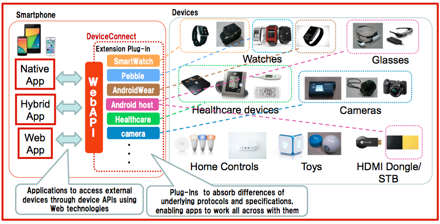

# DeviceConnect-Experiments
This repository contains demonstrations environments as experiment.

### Environment List for Demo
|Demo Name|Description|
|---------|-----------|
|[MWC2015 Demo](https://github.com/DeviceConnect/DeviceConnect-Experiments/tree/master/MWC2015)|ccc|
|[CEATEC2015 Demo](https://github.com/DeviceConnect/DeviceConnect-Experiments/tree/master/CEATEC2015)|aaa|
|[Home Electronics Demo](https://github.com/DeviceConnect/DeviceConnect-Experiments/tree/master/HomeElectronics)|bbb|
|[WebRTC Demo](https://github.com/DeviceConnect/DeviceConnect-Experiments/tree/master/WebRTC)|eee|
|[Presentation Demo](https://github.com/DeviceConnect/DeviceConnect-Experiments/tree/master/PresentationDemo)|ddd|

# DeviceConnect WebAPI -OMA GotAPI implementation-

DeviceConnect WebAPI achieves interoperability for various OS and protocols.

 
* NTT DOCOMO open sourced GotAPI project as “Device Connect”
	* [https://github.com/DeviceConnect/](https://github.com/DeviceConnect/)
* It will soon be updated to be compliant with GotAPI 1.0
